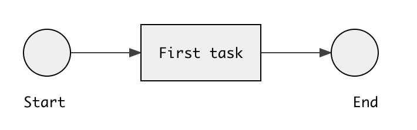

### Gent - Library for easy business processes implementation

# Gent core

This is core part of gent, use it in your project to construct your process structure.

Install:

```
npm install gent-core

# or

yarn add gent-core
```

Check [gent-example](https://github.com/stepan662/gent-example) project to see how to connect processes to your API and database.

## Simple usage

Purpose of this library is to allow you to construct executable business processes

Basic example:

```ts
import Builder from 'gent-core/lib/NodeBuilder'
import * as Node from 'gent-core/lib/Node'
import Process from 'gent-core/lib/Process'

const [start, task] = Builder.connect(
  // start event
  Node.start({
    name: 'Start',
  }),

  // task
  Node.taskSystem({
    id: 'task',
    name: 'First task',
    exec: async () => {
      console.log('Hello my first task')
    },
  }),
)

task.connect(
  // end event
  Node.end({
    name: 'End',
  }),
)

const simpleProcess = new Process(
  {
    id: 'process',
    name: 'My first process',
    init: (input) => input,
  },
  start,
)

export default simpleProcess
```

On above example we see how to construct following process:



(Image is generated by [gent-diagram](https://github.com/stepan662/gent/tree/master/gent-diagram) library - which is able to visualize business process from it's schema)

We see that we start by connecting start event with first task.

```ts
const [start, task] = Builder.connect(
  Node.start({
    name: 'Start',
  }),
  Node.link(),
  Node.taskSystem({
    name: 'First task',
    ...
  }),
)
```

As a result we get two objects `start` and `task` - these are wrapped process components and we've already defined connection between them. By another command expression, we add end event.

```ts
task.connect(
  Node.link(),
  Node.end({
    name: 'End',
  }),
)
```

This creates complete process graph and then we pack it into `Process` class:

```ts
const simpleProcess = new Process(
  {
    id: 'process',
    name: 'My first process',
    init: (input) => input,
  },
  start,
)
```

You can see, that we just hand start event (which we get at the beginning) and some other configuration and we have complete process. To run the process on your server check project [gent-example](https://github.com/stepan662/gent-example), which demonstrates how to connect process to your REST API and database.

# Basic documentation

## Node module

This module contains functions to construct basic components of business process, mainly: `start`, `end`, `link`, `exclusive`, `taskUser` and `taskSystem`. You can see couple of them used in first example, let's look at them in detail.

#### `Node.start(options?)`

This is an entry point of the process and has no further logic inside. We can specify start event name, which will be displayed in diagram.

```ts
Node.start({ name: 'Start' })
```

#### `Node.end(options?)`

Similarly as start event, this event also doesn't have any inside logic, it's purely informative for the process, we can specify `name` and `id`. Id will be also part of the schema and it can come handy, if we want to identify which end event was triggered, as there can be multiple end events in the schema.

```ts
Node.end({ id: 'end1' name: 'End' })
```

#### `Node.link(options?)`

This object represents the link between two elements. We can also add `name` property, to display it in the schema. And also optionally `id`, which will come in handy with a exclusive gateway (read further).

```ts
Node.link({ id: 'link1' name: 'Link to somewhere' })
```

#### `Node.taskSystem(options)`

By this object we can define system task, which we use for performing some piece of work.
We can specify `id` and `name` as with previous elements, but we also need to specify `exec` callback. In this callback we can execute custom code and because we can use asynchronous functions, we can also perform http requests to another systems to connect business process with outside world.
Basic usage can be following:

```ts
Node.taskSystem({
  id: 'system_task',
  name: 'System task',
  exec: () => {
    console.log('Hello my first task')
    return { result: 'Yo' }
  },
}),
```

Notice that we return some data from callback. This data will get stored in the process state and will be further accessible during the process execution.

#### `Node.taskUser(options)`

This task type has similar interface as previous one, however it's purpose is to handle incoming data from user. When this task get's executed the system will get into special mode, where it's waiting for incoming data. Once the data are received, process can resume and continue execution. You need to implement callback `resolve`, which serves primally as data validator and then return data that you want to accept.

```ts
Node.taskUser({
  id: 'user_task',
  name: 'User task',
  resolve: (data) => {
    console.log('Accepting user data, yay!!')
    return data
  },
})
```

Once data from user get accepted, we return them similarly as before, so they are accessible later.

#### `Node.exclusive(options)`

This component represents exclusive gateway and accepts common attributes like `name` and `id`. It further requires mandatory callback function `decide`, which needs to return an id of next branch (id on `link` component as is shown above). Simple example:

```ts
Node.exclusive({
  name: 'Manual or auto?',
  decide: (results) => {
    return 'link1'
  },
})
```

This example presumes, that we later connect this component will have connection to another element with link id `link1` and therefore in execution time, we will decide for that branch. Exclusive gateway can have unlimited number of out-coming connections, only thing we need to keep eye on are correct ids on links and in `decide` function. Notice that in last example we return value statically, which means, gateway will always decide to go the same way. However we get parameter `results`, which contains data from previous tasks.

So if we would run e.g. `systemTask` from example above before this gateway. The `result` object would contain following object:

```ts
{
  system_task: {
    result: 'Yay!'
  }
}
```

So we can use this data to decide based on previous tasks and therefore use this component to dynamic routing through the process.

## NodeBuilder class

This module allows connecting above components together to construct process structure. `NodeBuilder` instances represent wrapped elements in the process, which can be connected with each other.

#### `static NodeBuilder.connect(component1, link?, component2): [wrappedComp1, wrappedComp2]`

This connect method is used to start the process by connecting first two elements. It will return tuple of wrapped components, which are instances of `NodeBuilder` class.

```ts
const [start, fistTask] = Builder.connect(
  Node.start({
    name: 'Start',
  }),
  Node.taskSystem({
    ...
  }),
)
```

Notice that `link` parameter is not mandatory, if we don't specify it, method will automatically add `Node.link()` component, so can specify it only if we need to add some additional properties to it.

#### `NodeBuilder.connect(link?, component2): wrappedComp2`

This is a dynamic method which we can use on already wrapped components to connect them with other components. Again `link` property is optional same as before. Method returns only second component which will be wrapped in `NodeBuilder` object. If the component was already wrapped, then it returns the same component.

```ts
// firstTask is taken from previous example
const secondTask = firstTask.connect(
  Node.taskUser({
    ...
  }),
)
```

Method accept already wrapped component or a new component, which haven't been wrapped before.By connecting to already wrapped component we can achieve non-linear graph with loops and forks. For example by following example we define an infinite loop `firstTask` -> `secondTask` -> `firstTask` and so on:

```ts
secondTask.connect(firstTask)
```

> **_NOTE:_** When component gets wrapped by `NodeBuilder` object, think of it as it has become a part of the specific graph, because it already has connections to other components, and if we use it repeatedly, it is treated as the same component and not duplicate.

As we connect separated pieces of the graph, we maintain their connections only by references, so in a sense they are still separate pieces (or can be defined as such). That way we can construct a piece of a process separately and later use it as a part of multiple processes.

## Process class

This class creates a complete process. Once we we wrap process into this class we can no longer make adjustments to the graph and so the `Process` class itself can make validation checks and store the process in more simple fashion by list of connections and nodes, which is more convenient for execution.

#### `Process.constructor(options, startNode)`

Constructor of this class will go through graph generated by `NodeBuilder` objects. In `options` parameter we specify `id`, `init` callback and optionally `name`. Id serves as universal identifier of this graph - so all the running instances of this process can be identified by that.

When we start the process we send it an initial data, and the `init` function is a place where they should be validated and the returned value from this method is stored similarly as with `taskUser` [resolve](<#`Node.taskUser(options)`>) function (under the key `start`) - so you can use it in same way as task output.

```ts
const simpleProcess = new Process(
  {
    id: 'process',
    name: 'My first process',
    init: (input) => {
      if (!validate(input)) {
        throw new Error(`Input is not valid`)
      }
      return input
    },
  },
  start,
)
```

As you can see on the example we can throw exception during the init function and in that case process won't get started. We can also adjust format of the input, if we want to store the value differently then it was received or add additional custom data, as this function can be also async we can fetch more data (e.g. to check if input data are correct).

#### `Process` data

Object process exposes it's inner structure, so you can simply use following data:

```ts
attributes: ProcessAttributes
nodes: NodeType[]
connections: Connection[]
```

`Attributes` are simply copied attributes received by constructor. `Nodes` is a list of elements in similar format as were defined by `Node` module functions.

> **_TIP:_** This library is shipped with typescript types, so you can explore exact object shapes directly in your editor.

## Automat class

Once we have `Process` object, we need some way how to execute it or interact with it. For this purpose, there is an `Automat` class. Basic usage looks like this:

```ts
import Automat from 'gent-core/lib/Automat'

const automat = new Automat(simpleProcess, myModifier)
```

> To understand how `Automat` class is intended to use I recommend to check [gent-example](https://github.com/stepan662/gent-example) project.

#### `Automat.constructor(process: Process, modifier: Modifier)`

First argument is a `Process` instance as we defined it earlier.

Argument `Modifier` represents connection of our automat to some kind of persistent storage. It is a simple interface, which can be explored by Typescript definition and example implementation is presented in [gent-example](https://github.com/stepan662/gent-example) project.

#### `Automat.initProcess(initialData: any): Promise<ProcessStateType>`

Use this method to initialize new process. We hand it initial data, which are passed to process [init](<#`Process.constructor(options,-startNode)`>) method.
Automat takes care of storing persistent data for us through `modifier` and it returns initially generated state of the process in a promise:

```ts
let state = await automat.initProcess({ test: true })
```

Once this method is successfully executed, process will switch to synchronous mode and will wait in a queue.

#### `Automat.poll(interval: number)`

This method will start a synchronous part of the automat, which will poll for active processes and execute their logic.

Argument `interval` will determine how often we want to poll for new active processes.

#### `Automat.runAsyncSubtask(processId: string, taskId: string, subtaskId: string, attrs: any[])`

This method is used to run async parts of the process (like [user task](<#Node.taskUser(options)>)). This method is intended to also be connected to user facing API (similarly as `initProcess`).

#### `Automat.runReadSubtask(processId: string, taskId: string, subtaskId: string, attrs: any[])`

This method is similar as previous one, however it serves to resolve read-only subtasks, which don't have read access to process state.
